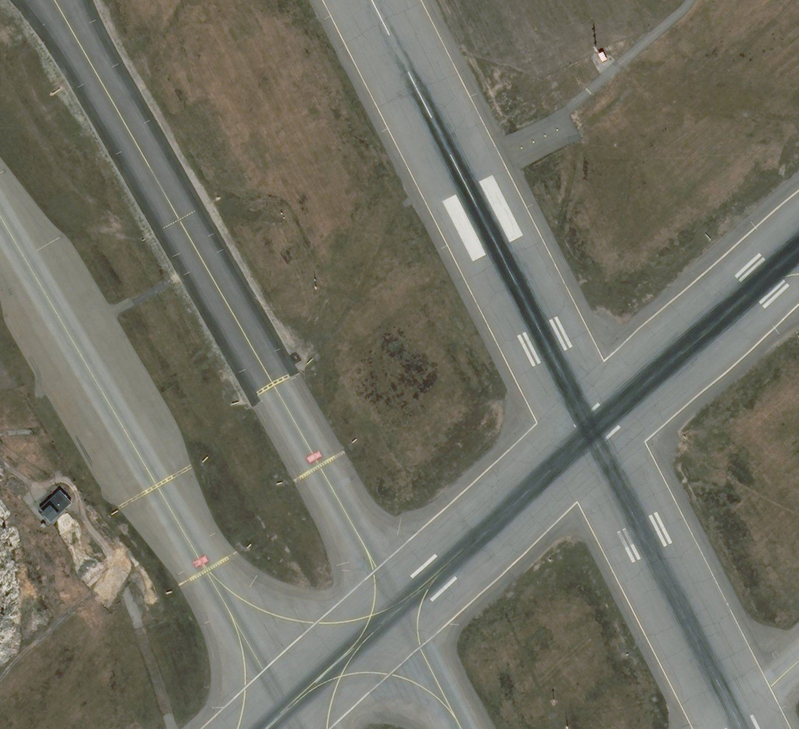
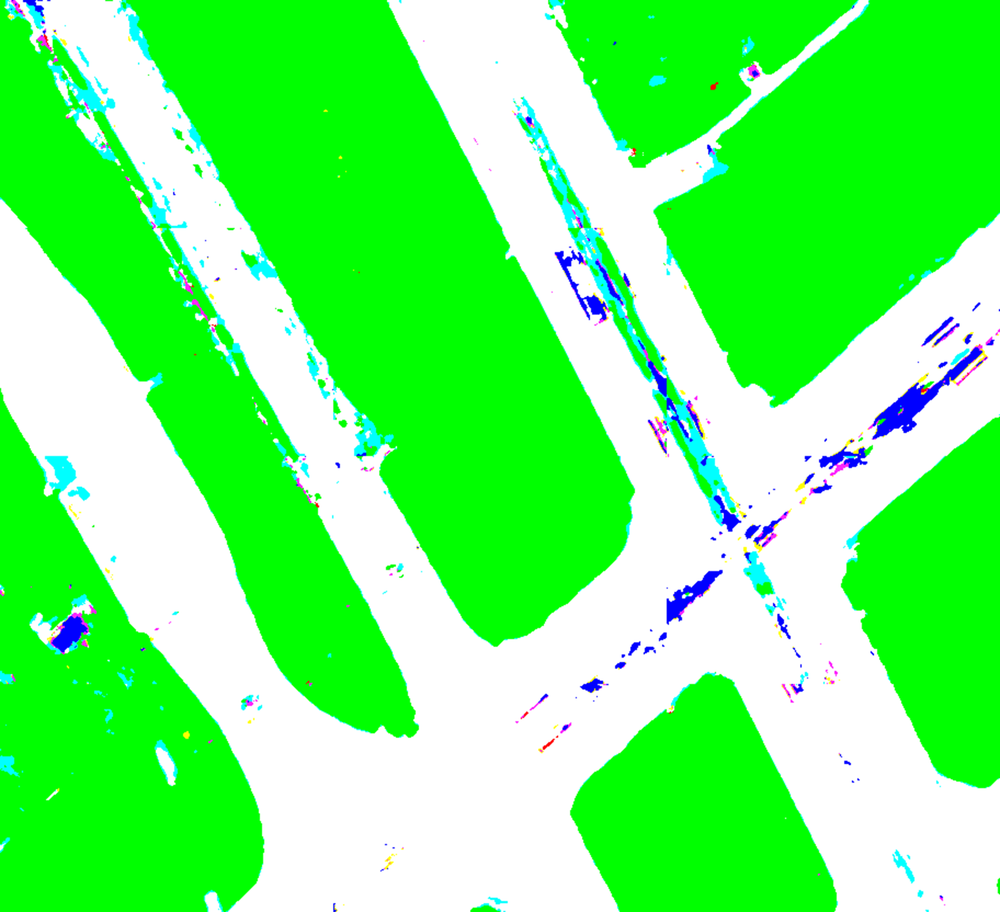
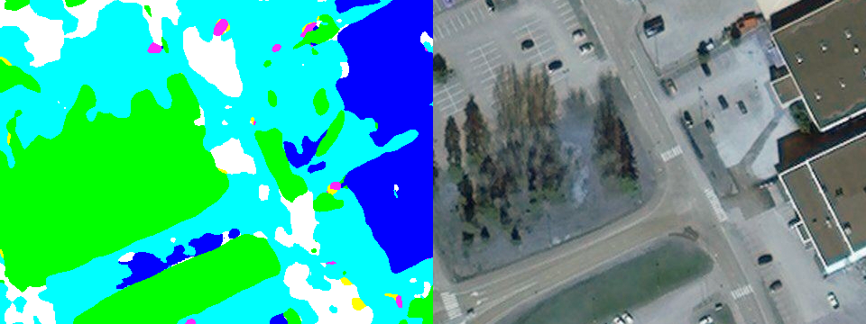

### Welcome to my paper notes
#### Задача: семантическая сегментация аэропортовых снимков, вид сверху. 

##### Классы
- здания (синий)
- растительность (зелёный)
- стройка/земля (жёлтый)
- бетон, покрытие аэропортовой инфраструктуры -- ВВП, рулёжки, стоянки (белый)
- асфальт, который не относится к покрытию аэропортовой инфраструктуры (бирюзовый)
- группы объектов на бетоне (розовый)
- другое (красный)

##### Результаты (VGG + U-Net)

  
  

##### Результаты (SegNet)

  

##### Что сделано
- предобработка и кодировка изображений в удобоваримый для обучения нейросети вид (код про это можно увидеть [здесь](https://github.com/tamamolis/CreateDataForSemanticSegmentation))
- несколько моделей нейросети
  - SegNet (код [здесь](https://github.com/tamamolis/NaiveSegNet))
  - Unet (получилось так плохо, что код утерян, лучше про него не упоминать)
  - VGG + Unet (код [здесь](https://github.com/tamamolis/VGGUnet))
- модели получены, обучены, результаты есть в репозиториях, указанных выше

##### Что сделать легко и приятно
- добавить другие модели, например, VGG + Unet и смотреть у чего лучше получается
- склейка итоговой картинки с перекрытием, а не в лоб
- уменьшить количество классов до четырёх или пяти и обучить на нём

##### Что сделать планируется и хочется, но пока не получается
- постобработка, конкретно CRF
- GAN, pix-to-pix и прочие наполеоновские планы

### Что сказал сделать Вадим, и это легко и приятно
- посмотреть у [isprs](http://www2.isprs.org/commissions/comm2/wg6/bench.html) как они оценивают результаты, их метрику
- посмотреть там же статьи, среди них две топовые: немцы и китайцы, глянуть что они там понаписали (конкретно про энтропийный слой)
- __очень важно__ прочитать [статью](https://meetshah1995.github.io/semantic-segmentation/deep-learning/pytorch/visdom/2017/06/01/semantic-segmentation-over-the-years.html)

### Что сказал сделать Вадим, и это трудно и противно
- добавить свой энтропийный (sick!) или ещё какой-то слой из вышеописанных статей
